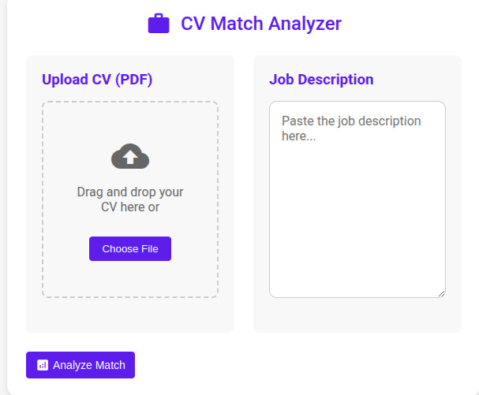

# HR Assistance App (CV and Job Description Matching Tool)

This application automates the process of matching job candidates' CVs with job descriptions to assist HR teams in streamlining their candidate screening process. By taking a candidate’s CV and a job description as input, the app generates a match score, helping HR teams quickly identify the most relevant candidates based on the alignment of their qualifications with the job requirements.

 
## Features
- **CV and Job Description Input**: Upload candidate CVs and job descriptions in a simple interface.
- **Match Score Generation**: Calculates a match score that reflects how well the candidate's qualifications align with the job description.
- **HR Rule-based Filtering**: Prioritizes relevant CVs that meet predefined HR rules, ensuring only the most qualified candidates are highlighted.
- **User-Friendly Interface**: Easy-to-navigate UI for uploading CVs and job descriptions, and viewing results.

## Technologies Used
- **Flowise**: Used for building the workflow and integrating Large Language Models (LLMs) to power the matching algorithm. 
  - **LLM Chains**: Utilized LLM chains to create a structured flow for processing input and generating results.
  - **Prompt Engineering**: Write custom prompts using prompt engineering techniques to enhance the accuracy of the matching algorithm.
  - **Advanced Structured Output Parsers**: Integrated advanced parsers to structure and analyze the output data for better decision-making and filtering.
  - **ZOD Schemas**: Employed ZOD schemas to define and validate data structures and ensure consistent results across different inputs.
  
- **Frontend**: Built the user interface using **HTML**, **CSS**, and **JavaScript** to ensure responsiveness and ease of use.

## Steps to Use

1. **Upload CV**: Choose the CV file of the candidate (in PDF, DOCX, or plain text format) by clicking on the "Upload CV" button.
   
2. **Upload Job Description**: Similarly, upload the job description file using the "Upload Job Description" button.

3. **Generate Match Score**: Click the **"Generate Match Score"** button to process the inputs and generate the match score based on how well the CV aligns with the job description.

4. **Review Results**:
   - The match score will appear, indicating how closely the candidate’s qualifications match the job requirements.
   - The tool will also provide a breakdown of the matching criteria, helping HR teams quickly filter out candidates who do not meet the essential job requirements.
   

    
     
     

## Results

After processing, the application will display:
- **Match Score**: A numerical value representing the degree of match between the candidate's qualifications and the job description.
- **Detailed Breakdown**: A summary of how different sections of the CV (e.g., skills, experience, education) align with the job description criteria.

This helps HR teams quickly identify the most relevant CVs based on predefined criteria and ensures only qualified candidates proceed to further stages of the hiring process.

